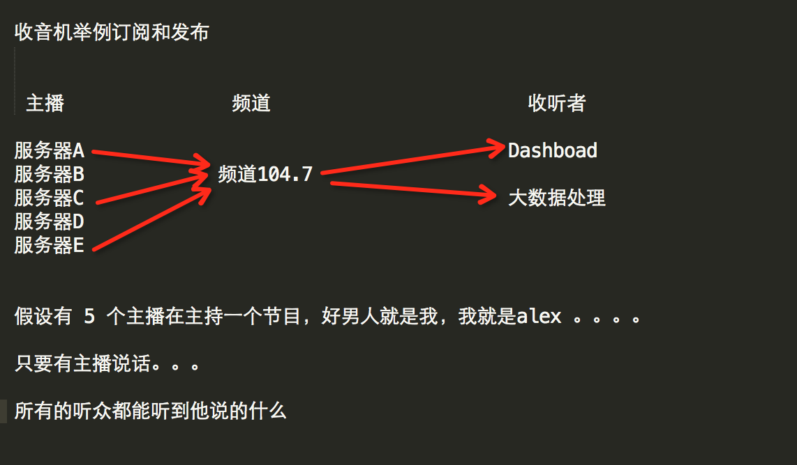

# [redis缓存数据库](https://www.cnblogs.com/alex3714/articles/6217453.html)

### 缓存数据库介绍 ###

 　　NoSQL(NoSQL = Not Only SQL )，意即“不仅仅是SQL”，泛指非关系型的数据库,随着互联网web2.0网站的兴起，传统的关系数据库在应付web2.0网站，特别是超大规模和高并发的SNS类型的web2.0纯动态网站已经显得力不从心，暴露了很多难以克服的问题，而非关系型的数据库则由于其本身的特点得到了非常迅速的发展。NoSQL数据库的产生就是为了解决大规模数据集合多重数据种类带来的挑战，尤其是大数据应用难题。

#### NoSQL数据库的四大分类 

**键值([*Key-Value*](http://baike.baidu.com/view/6728383.htm) )存储[数据库](http://baike.baidu.com/view/1088.htm)**

　　这一类数据库主要会使用到一个[哈希表](http://baike.baidu.com/view/329976.htm) ，这个表中有一个特定的键和一个指针指向特定的数据。Key/value模型对于IT系统来说的优势在于简单、易部署。但是如果[DBA](http://baike.baidu.com/subview/67156/5112091.htm) 只对部分值进行查询或更新的时候，Key/value就显得效率低下了。  举例如：Tokyo Cabinet/Tyrant, Redis, Voldemort, Oracle BDB.

**列存储数据库。**

 　　这部分数据库通常是用来应对分布式存储的海量数据。键仍然存在，但是它们的特点是指向了多个列。这些列是由列家族来安排的。如：Cassandra, HBase, Riak.

**文档型数据库**

　　文档型数据库的灵感是来自于Lotus Notes办公软件的，而且它同第一种键值存储相类似。该类型的数据模型是版本化的文档，半结构化的文档以特定的格式存储，比如JSON。文档型数据库可 以看作是键值数据库的升级版，允许之间嵌套键值。而且文档型数据库比键值数据库的查询效率更高。如：CouchDB, MongoDb. 国内也有文档型数据库SequoiaDB，已经开源。

**图形(Graph)数据库**

　　图形结构的数据库同其他行列以及刚性结构的SQL数据库不同，它是使用灵活的图形模型，并且能够扩展到多个服务器上。NoSQL数据库没有标准的查询语言(SQL)，因此进行数据库查询需要制定数据模型。许多NoSQL数据库都有REST式的数据接口或者查询API。[2]  如：Neo4J, InfoGrid, Infinite Graph.

　　因此，我们总结NoSQL数据库在以下的这几种情况下比较适用：
1. 数据模型比较简单；
2. 需要灵活性更强的IT系统；
3. 对数据库性能要求较高；
4. 不需要高度的数据一致性；
5. 对于给定key，比较容易映射复杂值的环境。

#### NoSQL数据库的四大分类表格分析 

|分类|Examples举例|典型应用场景|数据模型|优点|缺点|
|--------|--------|--------|--------|--------|--------|
|键值（key-value） |Tokyo Cabinet/Tyrant, Redis, Voldemort, Oracle BDB|内容缓存，主要用于处理大量数据的高访问负载，也用于一些日志系统等等。 |Key 指向 Value 的键值对，通常用hash table来实现 |查找速度快|数据无结构化，通常只被当作字符串或者二进制数据 |
|列存储数据库 |Cassandra, HBase, Riak|分布式的文件系统|以列簇式存储，将同一列数据存在一起|查找速度快，可扩展性强，更容易进行分布式扩展|功能相对局限|
|文档型数据库 |CouchDB, MongoDb|Web应用（与Key-Value类似，Value是结构化的，不同的是数据库能够了解Value的内容）|Key-Value对应的键值对，Value为结构化数据|数据结构要求不严格，表结构可变，不需要像关系型数据库一样需要预先定义表结构|查询性能不高，而且缺乏统一的查询语法。|
|图形(Graph)数据库 |Neo4J, InfoGrid, Infinite Graph|社交网络，推荐系统等。专注于构建关系图谱|图结构|利用图结构相关算法。比如最短路径寻址，N度关系查找等|很多时候需要对整个图做计算才能得出需要的信息，而且这种结构不太好做分布式的集群方案。 |

### redis 

#### 介绍 

　　redis是业界主流的key-value nosql 数据库之一。和Memcached类似，它支持存储的value类型相对更多，包括string(字符串)、list([链表](http://baike.baidu.com/view/549479.htm) )、set(集合)、zset(sorted set --有序集合)和hash（哈希类型）。这些[数据类型](http://baike.baidu.com/view/675645.htm) 都支持push/pop、add/remove及取交集并集和差集及更丰富的操作，而且这些操作都是原子性的。在此基础上，redis支持各种不同方式的排序。与memcached一样，为了保证效率，数据都是缓存在内存中。区别的是redis会周期性的把更新的数据写入磁盘或者把修改操作写入追加的记录文件，并且在此基础上实现了master-slave(主从)同步。

#### Redis优点 

- 异常快速 : Redis是非常快的，每秒可以执行大约110000设置操作，81000个/每秒的读取操作。

- 支持丰富的数据类型 : Redis支持最大多数开发人员已经知道如列表，集合，可排序集合，哈希等数据类型。这使得在应用中很容易解决的各种问题，因为我们知道哪些问题处理使用哪种数据类型更好解决。

- 操作都是原子的 : 所有 Redis 的操作都是原子，从而确保当两个客户同时访问 Redis 服务器得到的是更新后的值（最新值）。

- MultiUtility工具：Redis是一个多功能实用工具，可以在很多如：缓存，消息传递队列中使用（Redis原生支持发布/订阅），在应用程序中，如：Web应用程序会话，网站页面点击数等任何短暂的数据；

#### 安装Redis环境 

要在 Ubuntu 上安装 Redis，打开终端，然后输入以下命令：

	$sudo apt-get update
	$sudo apt-get install redis-server

这将在您的计算机上安装Redis

启动 Redis

	$redis-server

查看 redis 是否还在运行

	$redis-cli

这将打开一个 Redis 提示符，如下图所示：

	redis 127.0.0.1:6379>


在上面的提示信息中：127.0.0.1 是本机的IP地址，6379是 Redis 服务器运行的端口。现在输入 PING 命令，如下图所示：

	redis 127.0.0.1:6379>ping
	PONG


这说明现在你已经成功地在计算机上安装了 Redis。


#### Python操作Redis 
	sudo pip install redis
	or
	sudo easy_install redis
	or
	源码安装
详见：[https://github.com/WoLpH/redis-py](https://github.com/WoLpH/redis-py)

#### 在Ubuntu上安装Redis桌面管理器 

 　　要在Ubuntu 上安装 Redis桌面管理，可以从 [http://redisdesktop.com/download](http://redisdesktop.com/download) 下载包并安装它。

Redis 桌面管理器会给你用户界面来管理 Redis 键和数据。

## Redis API使用 

redis-py 的API的使用可以分类为：

- 连接方式
- 连接池
- 操作
- String 操作
- Hash 操作
- List 操作
- Set 操作
- Sort Set 操作
- 管道
- 发布订阅

### 连接方式 ###

1、操作模式

　　redis-py提供两个类Redis和StrictRedis用于实现Redis的命令，StrictRedis用于实现大部分官方的命令，并使用官方的语法和命令，Redis是StrictRedis的子类，用于向后兼容旧版本的redis-py。

	import redis 
	r =redis.Redis(host='10.211.55.4', port=6379)
	r.set('foo', 'Bar')
	print r.get('foo')
2、连接池

　　redis-py使用connection pool来管理对一个redis server的所有连接，避免每次建立、释放连接的开销。默认，每个Redis实例都会维护一个自己的连接池。可以直接建立一个连接池，然后作为参数Redis，这样就可以实现多个Redis实例共享一个连接池。

### 操作 ###

#### 1. String操作 ####

redis中的String在在内存中按照一个name对应一个value来存储。如图：

	name　　　　　　　value 
	n1　　------>　　'123'
	n2　　------>　　'abc'
```
set(name, value, ex=None, px=None, nx=False, xx=False)
在Redis中设置值，默认，不存在则创建，存在则修改
参数：
     ex，过期时间（秒）
     px，过期时间（毫秒）
     nx，如果设置为True，则只有name不存在时，当前set操作才执行
     xx，如果设置为True，则只有name存在时，当前set操作才执行
```
```
setnx(name, value)
#设置值，只有name不存在时，执行设置操作（添加)
```
```
setex(name, value, time)
#设置值
# 参数：   
	# time，过期时间（数字秒 或 timedelta对象）
```
```
psetex(name, time_ms, value)
# 设置值
# 参数：    
	# time_ms，过期时间（数字毫秒 或 timedelta对象）
```
```	
mset(*args, **kwargs)
批量设置值
如：
    mset(k1='v1', k2='v2')
    或
    mset({'k1': 'v1', 'k2': 'v2'})
```
```
get(name)
# 获取值
```
```
mget(keys, *args)
批量获取
如：
    mget('ylr', 'wupeiqi')
    或
    r.mget(['ylr', 'wupeiqi'])
```
```
getset(name, value)
# 设置新值并获取原来的值
```
```
getrange(key, start, end)
# 获取子序列（根据字节获取，非字符）
# 参数：
    # name，Redis 的 name
    # start，起始位置（字节）
    # end，结束位置（字节）
# 如： "武沛齐" ，0-3表示 "武"
```
```
setrange(name, offset, value)
# 修改字符串内容，从指定字符串索引开始向后替换（新值太长时，则向后添加）
# 参数：
    # offset，字符串的索引，字节（一个汉字三个字节）
    # value，要设置的值
```
```
setbit(name, offset, value)
# 对name对应值的二进制表示的位进行操作

# 参数：
    # name，redis的name
    # offset，位的索引（将值变换成二进制后再进行索引）
    # value，值只能是 1 或 0
 
# 注：如果在Redis中有一个对应： n1 = "foo"，
	那么字符串foo的二进制表示为：01100110 01101111 01101111
    所以，如果执行 setbit('n1', 7, 1)，则就会将第7位设置为1，
	那么最终二进制则变成 01100111 01101111 01101111，即："goo"
 
# 扩展，转换二进制表示：
 
    # source = "武沛齐"
    source = "foo"
 
    for i in source:
	num = ord(i)
	print bin(num).replace('b','')

特别的，如果source是汉字 "武沛齐"怎么办？
答：对于utf-8，每一个汉字占 3 个字节，那么 "武沛齐" 则有 9个字节
对于汉字，for循环时候会按照 字节 迭代，那么在迭代时，将每一个字节转换 十进制数，然后再将十进制数转换成二进制
11100110 10101101 10100110 11100110 10110010 10011011 11101001 10111101 10010000
```
**用途举例，用最省空间的方式，存储在线用户数及分别是哪些用户在线**
```
getbit(name, offset)
# 获取name对应的值的二进制表示中的某位的值 （0或1）
```
```
bitcount(key, start=None, end=None)
# 获取name对应的值的二进制表示中 1 的个数
# 参数：
    # key，Redis的name
    # start，位起始位置
    # end，位结束位置
```
```
strlen(name)
# 返回name对应值的字节长度（一个汉字3个字节）
```
```
incr(self, name, amount=1)
# 自增 name对应的值，当name不存在时，则创建name＝amount，否则，则自增。

# 参数：
    # name,Redis的name
    # amount,自增数（必须是整数）
 
# 注：同incrby
```
```
incrbyfloat(self, name, amount=1.0)
# 自增 name对应的值，当name不存在时，则创建name＝amount，否则，则自增。

# 参数：
    # name,Redis的name
    # amount,自增数（浮点型）
```
```
decr(self, name, amount=1)
# 自减 name对应的值，当name不存在时，则创建name＝amount，否则，则自减。

# 参数：
    # name,Redis的name
    # amount,自减数（整数）
```
```
append(key, value)
# 在redis name对应的值后面追加内容

# 参数：
    key, redis的name
    value, 要追加的字
```
#### 2. Hash操作 ####

　　hash表现形式上有些像pyhton中的dict,可以存储一组关联性较强的数据 ， redis中Hash在内存中的存储格式如下图：　　

	name　　　　　　　　list 
	n1　　------>　　{'a':'b','c':'d'}
	n2　　------>　　{'a':1,'c':2}
```
hset(name, key, value)
# name对应的hash中设置一个键值对（不存在，则创建；否则，修改）

# 参数：
    # name，redis的name
    # key，name对应的hash中的key
    # value，name对应的hash中的value
 
# 注：
    # hsetnx(name, key, value),当name对应的hash中不存在当前key时则创建（相当于添加）
```
```
hmset(name, mapping)
# 在name对应的hash中批量设置键值对

# 参数：
    # name，redis的name
    # mapping，字典，如：{'k1':'v1', 'k2': 'v2'}
 
# 如：
    # r.hmset('xx', {'k1':'v1', 'k2': 'v2'})
```
```
hget(name,key)
# 在name对应的hash中获取根据key获取value
```
```
hmget(name, keys, *args)
# 在name对应的hash中获取多个key的值

# 参数：
    # name，reids对应的name
    # keys，要获取key集合，如：['k1', 'k2', 'k3']
    # *args，要获取的key，如：k1,k2,k3
 
# 如：
    # r.mget('xx', ['k1', 'k2'])
    # 或
    # print r.hmget('xx', 'k1', 'k2')
```
```
hgetall(name)
获取name对应hash的所有键值
```
```
hlen(name)
# 获取name对应的hash中键值对的个数
```
```
hkeys(name)
# 获取name对应的hash中所有的key的值
```
```
hvals(name)
# 获取name对应的hash中所有的value的值
```
```
hexists(name, key)
# 检查name对应的hash是否存在当前传入的key
```
```
hdel(name,*keys)
# 将name对应的hash中指定key的键值对删除
```
```
hincrby(name, key, amount=1)
# 自增name对应的hash中的指定key的值，不存在则创建key=amount
# 参数：
    # name，redis中的name
    # key， hash对应的key
    # amount，自增数（整数）
```
```
hincrbyfloat(name, key, amount=1.0)
# 自增name对应的hash中的指定key的值，不存在则创建key=amount

# 参数：
    # name，redis中的name
    # key， hash对应的key
    # amount，自增数（浮点数）
 
# 自增name对应的hash中的指定key的值，不存在则创建key=amount
```
```
hscan(name, cursor=0, match=None, count=None)

Start a full hash scan with:
HSCAN myhash 0
Start a hash scan with fields matching a pattern with:
HSCAN myhash 0 MATCH order_*
Start a hash scan with fields matching a pattern and forcing the scan command to do more scanning with:
HSCAN myhash 0 MATCH order_* COUNT 1000
# 增量式迭代获取，对于数据大的数据非常有用，hscan可以实现分片的获取数据，并非一次性将数据全部获取完，从而放置内存被撑爆

# 参数：
    # name，redis的name
    # cursor，游标（基于游标分批取获取数据）
    # match，匹配指定key，默认None 表示所有的key
    # count，每次分片最少获取个数，默认None表示采用Redis的默认分片个数
 
# 如：
    # 第一次：cursor1, data1 = r.hscan('xx', cursor=0, match=None, count=None)
    # 第二次：cursor2, data1 = r.hscan('xx', cursor=cursor1, match=None, count=None)
    # ...
    # 直到返回值cursor的值为0时，表示数据已经通过分片获取完毕
```
```
hscan_iter(name, match=None, count=None)
# 利用yield封装hscan创建生成器，实现分批去redis中获取数据

# 参数：
    # match，匹配指定key，默认None 表示所有的key
    # count，每次分片最少获取个数，默认None表示采用Redis的默认分片个数
  
# 如：
    # for item in r.hscan_iter('xx'):
    #     print item
```
#### 3. list 

List操作，redis中的List在在内存中按照一个name对应一个List来存储。如图：　　

	name　　　　　　　　list 
	n1　　------>　　[1,2,3,4]
	n2　　------>　　[a,b,c,d]
```
lpush(name,values)
# 在name对应的list中添加元素，每个新的元素都添加到列表的最左边
 
# 如：
    # r.lpush('oo', 11,22,33)
    # 保存顺序为: 33,22,11
 
# 扩展：
    # rpush(name, values) 表示从右向左操作
```
```
lpushx(name,value)
# 在name对应的list中添加元素，只有name已经存在时，值添加到列表的最左边
 
# 更多：
    # rpushx(name, value) 表示从右向左操作
```
```
llen(name)
# name对应的list元素的个数
```
```
linsert(name, where, refvalue, value))
# 在name对应的列表的某一个值前或后插入一个新值
 
# 参数：
    # name，redis的name
    # where，BEFORE或AFTER
    # refvalue，标杆值，即：在它前后插入数据
    # value，要插入的数据
```
```
r.lset(name, index, value)
# 对name对应的list中的某一个索引位置重新赋值
 
# 参数：
    # name，redis的name
    # index，list的索引位置
    # value，要设置的值
```
```
r.lrem(name, value, num)
# 在name对应的list中删除指定的值
 
# 参数：
    # name，redis的name
    # value，要删除的值
    # num，  num=0，删除列表中所有的指定值；
           # num=2,从前到后，删除2个；
           # num=-2,从后向前，删除2个
```
```
lpop(name)
# 在name对应的列表的左侧获取第一个元素并在列表中移除，返回值则是第一个元素
 
# 更多：
    # rpop(name) 表示从右向左操作
```
```
lindex(name, index)
在name对应的列表中根据索引获取列表元素
```
```
lrange(name, start, end)
# 在name对应的列表分片获取数据
# 参数：
    # name，redis的name
    # start，索引的起始位置
    # end，索引结束位置
```
```
ltrim(name, start, end)
# 在name对应的列表中移除没有在start-end索引之间的值
# 参数：
    # name，redis的name
    # start，索引的起始位置
    # end，索引结束位置
```
```
rpoplpush(src, dst)
# 从一个列表取出最右边的元素，同时将其添加至另一个列表的最左边
# 参数：
    # src，要取数据的列表的name
    # dst，要添加数据的列表的name
```
```
blpop(keys, timeout)
# 将多个列表排列，按照从左到右去pop对应列表的元素
 
# 参数：
    # keys，redis的name的集合
    # timeout，超时时间，当元素所有列表的元素获取完之后，阻塞等待列表内有数据的时间（秒）, 0 表示永远阻塞
 
# 更多：
    # r.brpop(keys, timeout)，从右向左获取数据
```
```
brpoplpush(src, dst, timeout=0)
# 从一个列表的右侧移除一个元素并将其添加到另一个列表的左侧
 
# 参数：
    # src，取出并要移除元素的列表对应的name
    # dst，要插入元素的列表对应的name
    # timeout，当src对应的列表中没有数据时，阻塞等待其有数据的超时时间（秒），0 表示永远阻塞

```
#### 4.set集合操作 

Set操作，Set集合就是不允许重复的列表
```
sadd(name,values)
# name对应的集合中添加元素
```
```
scard(name)
获取name对应的集合中元素个数
```
```
sdiff(keys, *args)
在第一个name对应的集合中且不在其他name对应的集合的元素集合
```
```
sdiffstore(dest, keys, *args)
# 获取第一个name对应的集合中且不在其他name对应的集合，再将其新加入到dest对应的集合中
```
```
sinter(keys, *args)
# 获取多一个name对应集合的并集
```
```
sinterstore(dest, keys, *args)
# 获取多一个name对应集合的并集，再讲其加入到dest对应的集合中
```
```
sismember(name, value)
# 检查value是否是name对应的集合的成员
```
```
smembers(name)
# 获取name对应的集合的所有成员
```
```
smove(src, dst, value)
# 将某个成员从一个集合中移动到另外一个集合
```
```
spop(name)
# 从集合的右侧（尾部）移除一个成员，并将其返回
```
```
srandmember(name, numbers)
# 从name对应的集合中随机获取 numbers 个元素
```
```
srem(name, values)
# 在name对应的集合中删除某些值
```
```
sunion(keys, *args)
# 获取多一个name对应的集合的并集
```
```
sunionstore(dest,keys, *args)
# 获取多一个name对应的集合的并集，并将结果保存到dest对应的集合中
```
```
sscan(name, cursor=0, match=None, count=None)
sscan_iter(name, match=None, count=None)
# 同字符串的操作，用于增量迭代分批获取元素，避免内存消耗太大
```
有序集合，在集合的基础上，为每元素排序；元素的排序需要根据另外一个值来进行比较，所以，对于有序集合，每一个元素有两个值，即：值和分数，分数专门用来做排序。

```
zadd(name, *args, **kwargs)
# 在name对应的有序集合中添加元素
# 如：
     # zadd('zz', 'n1', 1, 'n2', 2)
     # 或
     # zadd('zz', n1=11, n2=22)
```
```
zcard(name)
# 获取name对应的有序集合元素的数量
```
```
zcount(name, min, max)
# 获取name对应的有序集合中分数 在 [min,max] 之间的个数
```
```
zincrby(name, value, amount)
# 自增name对应的有序集合的 name 对应的分数
```
```
r.zrange( name, start, end, desc=False, withscores=False, score_cast_func=float)
# 按照索引范围获取name对应的有序集合的元素
 
# 参数：
    # name，redis的name
    # start，有序集合索引起始位置（非分数）
    # end，有序集合索引结束位置（非分数）
    # desc，排序规则，默认按照分数从小到大排序
    # withscores，是否获取元素的分数，默认只获取元素的值
    # score_cast_func，对分数进行数据转换的函数
 
# 更多：
    # 从大到小排序
    # zrevrange(name, start, end, withscores=False, score_cast_func=float)
 
    # 按照分数范围获取name对应的有序集合的元素
    # zrangebyscore(name, min, max, start=None, num=None, withscores=False, score_cast_func=float)
    # 从大到小排序
    # zrevrangebyscore(name, max, min, start=None, num=None, withscores=False, score_cast_func=float)
```
```
zrank(name, value)
# 获取某个值在 name对应的有序集合中的排行（从 0 开始）
 
# 更多：
    # zrevrank(name, value)，从大到小排序
```
```
zrem(name, values)
# 删除name对应的有序集合中值是values的成员 
# 如：zrem('zz', ['s1', 's2'])
```
```
zremrangebyrank(name, min, max)
# 根据排行范围删除
```
```
zremrangebyscore(name, min, max)
# 根据分数范围删除 
```
```
zscore(name, value)
# 获取name对应有序集合中 value 对应的分数
```
```
zinterstore(dest, keys, aggregate=None)
# 获取两个有序集合的交集，如果遇到相同值不同分数，则按照aggregate进行操作
# aggregate的值为:  SUM  MIN  MAX
```
```
zunionstore(dest, keys, aggregate=None)
# 获取两个有序集合的并集，如果遇到相同值不同分数，则按照aggregate进行操作
# aggregate的值为:  SUM  MIN  MAX
```
```
zscan(name, cursor=0, match=None, count=None, score_cast_func=float)
zscan_iter(name, match=None, count=None,score_cast_func=float)
# 同字符串相似，相较于字符串新增score_cast_func，用来对分数进行操作
```
#### 其他常用操作
```
delete(*names)
# 根据删除redis中的任意数据类型
```
```
exists(name)
# 检测redis的name是否存在
```
```
keys(pattern='*')
# 根据模型获取redis的name
 
# 更多：
    # KEYS * 匹配数据库中所有 key 。
    # KEYS h?llo 匹配 hello ， hallo 和 hxllo 等。
    # KEYS h*llo 匹配 hllo 和 heeeeello 等。
    # KEYS h[ae]llo 匹配 hello 和 hallo ，但不匹配 hillo
```
```
expire(name ,time)
# 为某个redis的某个name设置超时时间
```
```
rename(src, dst)
# 对redis的name重命名为
```
```
move(name, db))
# 将redis的某个值移动到指定的db下
```
```
randomkey()
# 随机获取一个redis的name（不删除）
```
```
type(name)
# 获取name对应值的类型
```
```
scan(cursor=0, match=None, count=None)
scan_iter(match=None, count=None)
# 同字符串操作，用于增量迭代获取key 
```

### 管道 

redis-py默认在执行每次请求都会创建（连接池申请连接）和断开（归还连接池）一次连接操作，如果想要在一次请求中指定多个命令，则可以使用pipline实现一次请求指定多个命令，并且默认情况下一次pipline 是原子性操作。

	#!/usr/bin/env python
	# -*- coding:utf-8 -*-
	 
	import redis
	 
	pool = redis.ConnectionPool(host='10.211.55.4', port=6379)
	 
	r = redis.Redis(connection_pool=pool)
	 
	# pipe = r.pipeline(transaction=False)
	pipe = r.pipeline(transaction=True)
	 
	pipe.set('name', 'alex')
	pipe.set('role', 'sb')
	 
	pipe.execute()


### 发布订阅 ###



发布者：服务器

订阅者：Dashboad和数据处理

Demo如下：

	import redis

	class RedisHelper:

	    def__init__(self):
		self.__conn = redis.Redis(host='10.211.55.4')
		self.chan_sub = 'fm104.5'
		self.chan_pub = 'fm104.5'
		
		def public(self, msg):
		self.__conn.publish(self.chan_pub, msg)
		return True

	    def subscribe(self):
		pub = self.__conn.pubsub()
		pub.subscribe(self.chan_sub)
		pub.parse_response()
		return pub


redis helper

订阅者：

	#!/usr/bin/env python
	# -*- coding:utf-8 -*-
	 
	from monitor.RedisHelper import RedisHelper
	 
	obj = RedisHelper()
	redis_sub = obj.subscribe()
	 
	while True:
	    msg= redis_sub.parse_response()
	    print msg

发布者：

	#!/usr/bin/env python
	# -*- coding:utf-8 -*-
	 
	from monitor.RedisHelper import RedisHelper
	 
	obj = RedisHelper()
	obj.public('hello')


更多参见：[https://github.com/andymccurdy/redis-py/](https://github.com/andymccurdy/redis-py/)

[http://doc.redisfans.com/](http://doc.redisfans.com/)

### 什么时候用关系型数据库，什么时候 用NoSQL? 

**在以下情况下转到遗留关系数据库（RDBMS）：**

1. 数据结构良好，适用于关系数据库中的表格排列（行和列）。典型示例：银行帐户信息，客户订单信息，客户信息，员工信息，部门信息等。
2. 上述观点的另一方面是：面向模式的数据模型。当您为潜在使用RDBMS设计数据模型（表，关系等）时，您需要提出一个定义良好的模式：将有这么多表，每个表都有一组已知的列，用于存储已知的数据键入格式（CHAR，NUMBER，BLOB等）。
3. 非常重要：考虑数据是否具有交易性质。换句话说，是否将在提供ACID语义的事务的上下文中存储，访问和更新数据，或者是否可以妥协某些/所有这些属性。
4. 正确性也很重要，任何妥协都是不可接受的。这源于这样一个事实：在大多数NoSQL数据库中，一致性被用于支持性能和可伸缩性（NoSQL数据库上的要点将在下面详述）。
5. 对于横向扩展架构没有强烈/迫切的需求;数据库，线性扩展（水平扩展）到群集中的多个节点。
6. 用例不适用于“高速数据摄取”。
7. 如果客户端应用程序期望快速地将大量数据流入/流出数据库，那么关系数据库可能不是一个好的选择，因为它们并非真正用于扩展写入繁重的工作负载。
8. 为了实现ACID属性，特别是在编写器（INSERT，UPDATE，DELETE）代码路径中进行了大量额外的后台工作。这肯定会影响性能。
9. 用例不是“存储数PB范围内的大量数据”。

**在以下情况下使用NoSQL数据库：**

1. 数据不适用于固定（和预定）架构：
2. 可扩展性，性能（高吞吐量和低操作延迟），连续可用性是数据库底层架构必须满足的非常重要的要求。
3. “高速数据摄取”的良好选择。这样的应用程序（例如IoT样式）在一秒钟内产生数百万个数据点，并且需要能够提供极端写入可伸缩性的数据库。
4. 水平扩展的固有能力允许在群集中的商用服务器上存储大量数据。它们通常使用低成本资源，并且能够随着需求的增长线性增加计算和存储能力。
source page [https://www.quora.com/When-should-you-use-NoSQL-vs-regular-RDBMS](https://www.quora.com/When-should-you-use-NoSQL-vs-regular-RDBMS)

### 附赠redis性能测试 ###

　　准备环境：

　　因为找不到可用的1000M网络机器，使用一根直通线将两台笔记本连起来组成1000M Ethernet网。没错，是直通线现在网卡都能自适应交叉线、直通线，速度不受影响，用了一段时间机器也没出问题。

　　服务端：T420 i5-2520M（2.5G）/8G ubuntu 11.10

　　客户端：Acer i5-2430M（2.4G）/4G mint 11

　　redis版本：2.6.9

　　测试脚本：./redis-benchmark -h xx -p xx -t set -q -r 1000 -l -d 20

|长度|速度/sec|带宽(MByte/s) 发送+接收|CPU|CPU Detail|
|--------|--------|--------|--------|--------|
|20Byte|17w|24M+12M|98.00%|Cpu0 : 21.0%us, 40.7%sy, 0.0%ni, 4.3%id, 0.0%wa, 0.0%hi, 34.0%si, 0.0%st|
|100Byte|17w|37M+12M|97.00%|Cpu0 : 20.3%us, 37.9%sy, 0.0%ni, 7.0%id, 0.0%wa, 0.0%hi, 34.9%si, 0.0%st|
|512Byte|12w|76M+9M|87.00%|Cpu0 : 20.9%us, 33.2%sy, 0.0%ni, 25.6%id, 0.0%wa, 0.0%hi, 20.3%si, 0.0%st|
|1K|9w|94M+8M|81.00%|Cpu0 : 19.9%us, 30.2%sy, 0.0%ni, 34.2%id, 0.0%wa, 0.0%hi, 15.6%si, 0.0%st|
|2K|5w|105M+6M|77.00%|Cpu0 : 18.0%us, 32.0%sy, 0.0%ni, 34.7%id, 0.0%wa, 0.0%hi, 15.3%si, 0.0%st|
|5K|2.2w|119M+3.2M|77.00%|Cpu0 : 22.5%us, 32.8%sy, 0.0%ni, 32.8%id, 0.0%wa, 0.0%hi, 11.9%si, 0.0%st|
|10K|1.1w|119M+1.7M|70.00%|Cpu0 : 18.2%us, 29.8%sy, 0.0%ni, 42.7%id, 0.0%wa, 0.0%hi, 9.3%si, 0.0%st|
|20K|0.57w|120M+1M|58.00%|Cpu0 : 17.8%us, 26.4%sy, 0.0%ni, 46.2%id, 0.0%wa, 0.0%hi, 9.6%si, 0.0%st|

　　value 在1K以上时，1000M网卡轻松的被跑慢，而且redis-server cpu连一个核心都没占用到，可见redis高效，redis的服务也不需要太高配置，瓶颈在网卡速度。

　　整理看redis的us都在20%左右，用户层代码资源占用比例都很小。
